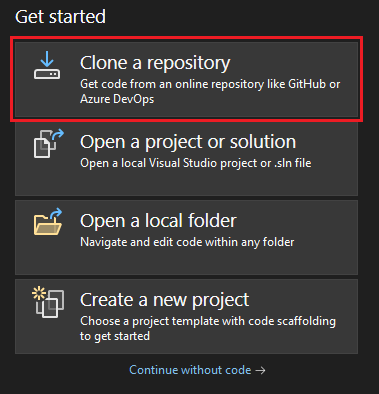
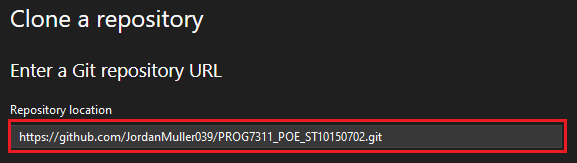
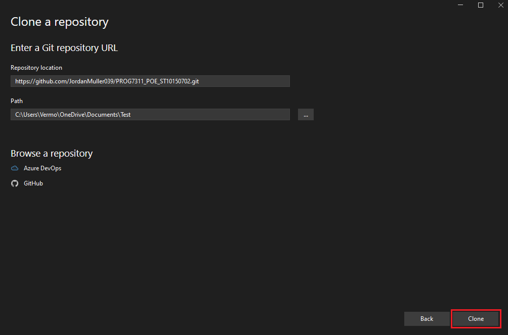
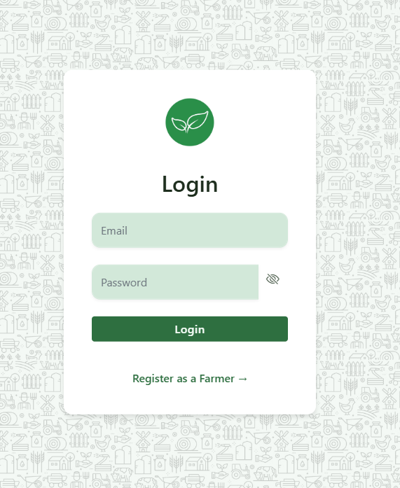
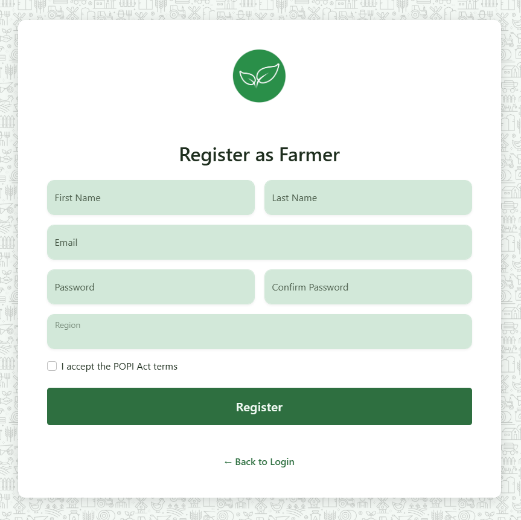
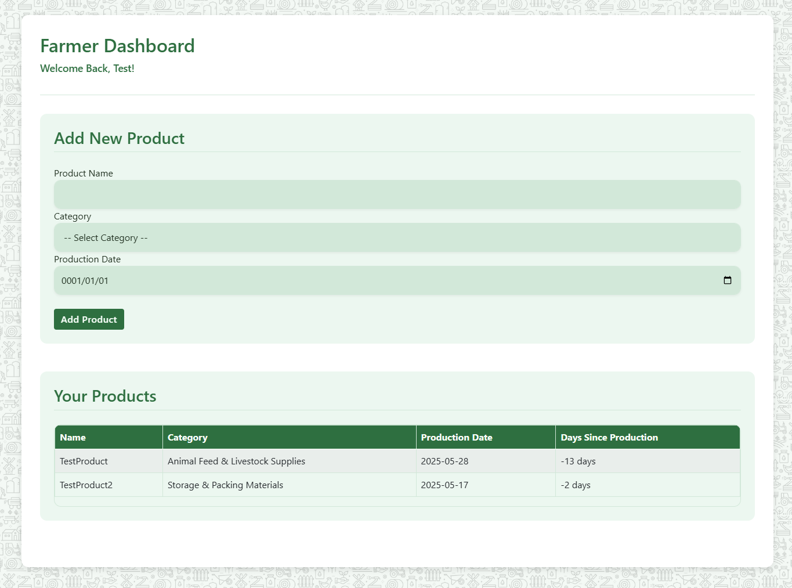
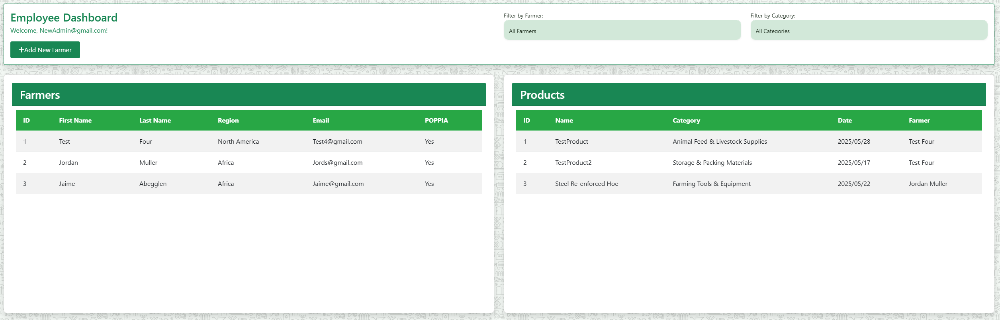
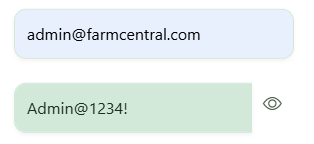

  

<h1 align="center">Agri-Energy Connect</h1>

<strong>ST10150702</strong>

 

<h2 align="center">About this Project</h2>

Agri-Energy Connect is a digital platform designed to bridge the gap between agricultural producers and sustainable energy solutions. 
This tool empowers farmers and energy experts to collaborate, track resource usage, and promote eco-friendly farming practices. 
With a focus on usability and data-driven insights, the system supports both environmental responsibility and agricultural productivity.

  

| Jordan Muller |   
  

<h2>Built With</h2>

  
   
  
   
  
   
  
   
  
   
  
    
  <a href="#top">(Back to Top)</a>

 
<h2>🚀 Getting Started</h2>

This program was created using <strong>Visual Studio Community 2022</strong>.

<h3>🛠️ Prerequisites</h3>

<ul>
  <li>
    <strong>Visual Studio</strong> 
    Ensure you have <em>Visual Studio Community 2022</em> installed. You can download it by clicking 
    <a href="https://visualstudio.microsoft.com/vs/" target="_blank">here</a> and following the official installation guide.
  </li>
   
  <li>
    <strong>Cloning the Repository</strong> 
    Once Visual Studio is installed, copy the repository URL: 
    <code>https://github.com/JordanMuller039/PROG7311_POE_ST10150702.git</code>
      
    Follow the steps shown in the images below:
      
     
    Navigate to <strong>"Clone a Repository"</strong> in Visual Studio.
      
     
    Paste the copied repo URL into the field shown above.
      
     
    Click <strong>"Clone"</strong> and allow Visual Studio to download the repository.
  </li>
</ul>

   
  <h2>📦 Database Setup</h2>

After cloning the repository, follow these steps to initialize the database using Entity Framework Core and LocalDB:

<ol>
  <li>Open the solution in <strong>Visual Studio 2022</strong>.</li>
  <li>Go to <code>Tools</code> → <code>NuGet Package Manager</code> → <code>Package Manager Console</code>.</li>
  <li>In the Package Manager Console, run the following commands:</li>
</ol>

<pre>
<code>
Add-Migration InitialCreate
Update-Database
</code>
</pre>

These commands will:

<ul>
  <li>Generate the initial database schema from your models.</li>
  <li>Create and seed the local database (if configured).</li>
</ul>

<strong>💡 Tip:</strong> Ensure your <code>appsettings.json</code> file includes a valid LocalDB connection string, such as:

<pre>
<code>
"ConnectionStrings": {
  "DefaultConnection": "Server=(localdb)\\mssqllocaldb;Database=YourDbName;Trusted_Connection=True;"
}
</code>
</pre>

<h2>📘 Usage</h2>

This prototype doesn’t need to be fully functional, but the following pages are available within the project:

  
  
  
  
  

<h3>🔑 Login Page</h3>

The user lands here first. From here, they can either log in using their credentials or click <strong>Register</strong> if they’re a first-time user.

<h4>🔐 Login Role Handling</h4>

The following code redirects the user to their respective dashboard based on their assigned role.

  
<strong>View Login Code</strong>

  <pre><code>
[HttpPost]
public async Task&lt;IActionResult&gt; Login(LoginViewModel model)
{
    if (ModelState.IsValid)
    {
        var user = await _userManager.FindByEmailAsync(model.Email);
        if (user == null)
        {
            ModelState.AddModelError(string.Empty, "Invalid login attempt.");
            return View(model);
        }
        var result = await _signInManager.PasswordSignInAsync(user, model.Password, model.RememberMe, false);
        if (result.Succeeded)
        {
            var roles = await _userManager.GetRolesAsync(user);
            if (roles.Contains("Admin"))
                return RedirectToAction("Dashboard", "Admin");
            else if (roles.Contains("Employee"))
                return RedirectToAction("EmployeeView", "Home");
            else if (roles.Contains("Farmer"))
                return RedirectToAction("FarmerView", "Home");
            return RedirectToAction("Index", "Home");
        }
        ModelState.AddModelError(string.Empty, "Invalid login attempt.");
    }
    return View(model);
}
  </code></pre>

<h3>📝 Register Page</h3>

Users must fill in several details to register. Upon successful registration, they’ll be redirected back to the login page to sign in.

<h4>👤 Register Role & Profile Setup</h4>

This code assigns the <code>Farmer</code> role by default and creates the corresponding profile.

  
<strong>View Register Code</strong>

  <pre><code>
[HttpPost]
public async Task&lt;IActionResult&gt; Register(RegisterViewModel model)
{
    if (!ModelState.IsValid)
        return View(model);
    var user = new ApplicationUser
    {
        UserName = model.Email,
        Email = model.Email,
        FirstName = model.FirstName,
        LastName = model.LastName
    };
    var result = await _userManager.CreateAsync(user, model.Password);
    if (result.Succeeded)
    {
        await _userManager.AddToRoleAsync(user, "Farmer");
        var farmer = new Farmer
        {
            FirstName = model.FirstName,
            LastName = model.LastName,
            Region = model.Region,
            AcceptedPOPPIA = model.AcceptedPOPPIA,
            UserId = user.Id
        };
        _context.Farmers.Add(farmer);
        await _context.SaveChangesAsync();
        await _signInManager.SignInAsync(user, isPersistent: false);
        return RedirectToAction("FarmerView", "Home");
    }
    foreach (var error in result.Errors)
        ModelState.AddModelError(string.Empty, error.Description);
    return View(model);
}
  </code></pre>

<h3>🌾 Farmer View</h3>

This page allows Farmers to manage their products—view, add, or update their listings.

<h4>📦 Add Product Logic (Farmer Only)</h4>

The following code ensures the farmer exists and saves the product to the database.

  
<strong>View AddProduct Code</strong>

  <pre><code>
[HttpPost]
[Authorize(Roles = &quot;Farmer&quot;)]
[ValidateAntiForgeryToken]
public async Task&lt;IActionResult&gt; AddProduct(Product product)
{
    if (ModelState.IsValid)
    {
        try
        {
            var farmerExists = await _context.Farmers
                .AnyAsync(f =&gt; f.FarmerId == product.FarmerId);
            if (!farmerExists)
            {
                ModelState.AddModelError(&quot;&quot;, &quot;Invalid farmer specified&quot;);
                return View(&quot;FarmerView&quot;, product);
            }
            _context.Products.Add(product);
            await _context.SaveChangesAsync();
            TempData[&quot;SuccessMessage&quot;] = $&quot;Product '{product.Name}' added successfully!&quot;;
            return RedirectToAction(&quot;FarmerView&quot;);
        }
        catch (Exception ex)
        {
            _logger.LogError(ex, &quot;Error adding product&quot;);
            ModelState.AddModelError(&quot;&quot;, &quot;Error saving product. Please try again.&quot;);
        }
    }
    var user = await _userManager.GetUserAsync(User);
    var farmer = await _context.Farmers.FirstOrDefaultAsync(f =&gt; f.UserId == user.Id);
    ViewBag.FarmerId = farmer?.FarmerId;
    ViewBag.FarmerFirstName = farmer?.FirstName;
    return View(&quot;FarmerView&quot;, product);
}
  </code></pre>

<h3>👨‍🌾 Employee View</h3>

Employees can view all farmers and products, add new farmers, and filter products by category or farmer.

<h3>🛠️ Admin Dashboard</h3>

To access the Admin Dashboard, use the pre-seeded login:

<ul>
  <li>Email: <code>admin@farmcentral.com</code></li>
  <li>Password: <code>Admin@1234!</code></li>
</ul>

This account is auto-created in <code>Program.cs</code> on startup.

