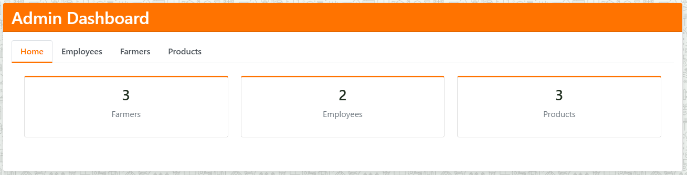
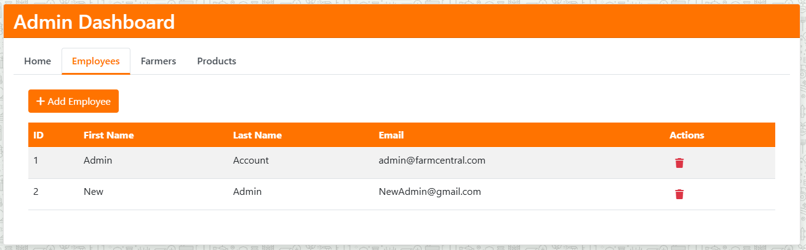
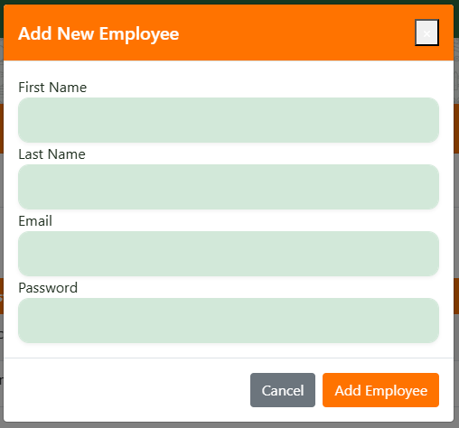
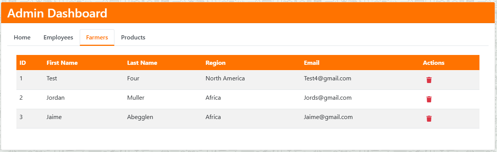
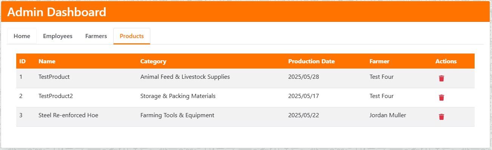
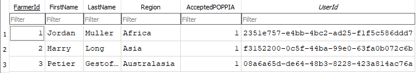
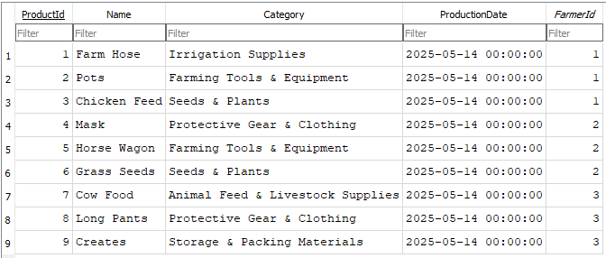
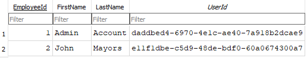
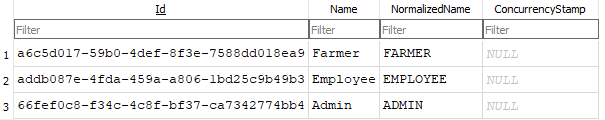

  

<h1 align="center">Agri-Energy Connect</h1>

<strong>ST10150702</strong>

 

<h2 align="center">About this Project</h2>

Agri-Energy Connect is a digital platform designed to bridge the gap between agricultural producers and sustainable energy solutions. 
This tool empowers farmers and energy experts to collaborate, track resource usage, and promote eco-friendly farming practices. 
With a focus on usability and data-driven insights, the system supports both environmental responsibility and agricultural productivity.

  

| Jordan Muller |   
  

<h2>Built With</h2>

  
   
  
   
  
   
  
   
  
   
  
    
  <a href="#top">(Back to Top)</a>

 
<h2>🚀 Getting Started</h2>

This program was created using <strong>Visual Studio Community 2022</strong>.

<h3>🛠️ Prerequisites</h3>

<ul>
  <li>
    <strong>Visual Studio</strong> 
    Ensure you have <em>Visual Studio Community 2022</em> installed. You can download it by clicking 
    <a href="https://visualstudio.microsoft.com/vs/" target="_blank">here</a> and following the official installation guide.
  </li>
   
  <li>
    <strong>Cloning the Repository</strong> 
    Once Visual Studio is installed, copy the repository URL: 
    <code>https://github.com/JordanMuller039/PROG7311_POE_ST10150702.git</code>
      
    Follow the steps shown in the images below:
      
     
    Navigate to <strong>"Clone a Repository"</strong> in Visual Studio.
      
     
    Paste the copied repo URL into the field shown above.
      
     
    Click <strong>"Clone"</strong> and allow Visual Studio to download the repository.
  </li>
</ul>

   
  <h2>📦 Database Setup</h2>

This project uses <strong>SQLite</strong> as its database engine, and the database file is included in the repository. No additional configuration or setup is required after cloning the project.

After cloning the repository:

<ol>
  <li>Open the solution in <strong>Visual Studio 2022</strong>.</li>
  <li>Build and run the project. The application will connect to the pre-configured SQLite database.</li>
</ol>

<strong>✔️ Benefits:</strong>

<ul>
  <li>No need to install or configure SQL Server or LocalDB.</li>
  <li>Database schema and seed data are already included.</li>
</ul>

<strong>💡 Note:</strong> The database file is located at <code>wwwroot/data/AgriEnergyConnect.db</code>.

<pre>
<code>
"ConnectionStrings": {
  "DefaultConnection": "Data Source=wwwroot/data/AgriEnergyConnect.db"
}
</code>
</pre>

<h2>📘 Usage</h2>

This prototype doesn’t need to be fully functional, but the following pages are available within the project:

  
  
  
  
  

<h3>🔑 Login Page</h3>

The user lands here first. From here, they can either log in using their credentials or click <strong>Register</strong> if they’re a first-time user.

<h4>🔐 Login Role Handling</h4>

The following code redirects the user to their respective dashboard based on their assigned role.

  
<strong>View Login Code</strong>

  <pre><code>
[HttpPost]
public async Task&lt;IActionResult&gt; Login(LoginViewModel model)
{
    if (ModelState.IsValid)
    {
        var user = await _userManager.FindByEmailAsync(model.Email);
        if (user == null)
        {
            ModelState.AddModelError(string.Empty, "Invalid login attempt.");
            return View(model);
        }
        var result = await _signInManager.PasswordSignInAsync(user, model.Password, model.RememberMe, false);
        if (result.Succeeded)
        {
            var roles = await _userManager.GetRolesAsync(user);
            if (roles.Contains("Admin"))
                return RedirectToAction("Dashboard", "Admin");
            else if (roles.Contains("Employee"))
                return RedirectToAction("EmployeeView", "Home");
            else if (roles.Contains("Farmer"))
                return RedirectToAction("FarmerView", "Home");
            return RedirectToAction("Index", "Home");
        }
        ModelState.AddModelError(string.Empty, "Invalid login attempt.");
    }
    return View(model);
}
  </code></pre>

<h3>📝 Register Page</h3>

Users must fill in several details to register. Upon successful registration, they’ll be redirected back to the login page to sign in.

<h4>👤 Register Role & Profile Setup</h4>

This code assigns the <code>Farmer</code> role by default and creates the corresponding profile.

  
<strong>View Register Code</strong>

  <pre><code>
[HttpPost]
public async Task&lt;IActionResult&gt; Register(RegisterViewModel model)
{
    if (!ModelState.IsValid)
        return View(model);
    var user = new ApplicationUser
    {
        UserName = model.Email,
        Email = model.Email,
        FirstName = model.FirstName,
        LastName = model.LastName
    };
    var result = await _userManager.CreateAsync(user, model.Password);
    if (result.Succeeded)
    {
        await _userManager.AddToRoleAsync(user, "Farmer");
        var farmer = new Farmer
        {
            FirstName = model.FirstName,
            LastName = model.LastName,
            Region = model.Region,
            AcceptedPOPPIA = model.AcceptedPOPPIA,
            UserId = user.Id
        };
        _context.Farmers.Add(farmer);
        await _context.SaveChangesAsync();
        await _signInManager.SignInAsync(user, isPersistent: false);
        return RedirectToAction("FarmerView", "Home");
    }
    foreach (var error in result.Errors)
        ModelState.AddModelError(string.Empty, error.Description);
    return View(model);
}
  </code></pre>

<h3>🌾 Farmer View</h3>

This page allows Farmers to manage their products—view, add, or update their listings.

To access the Farmer View, use the pre-seeded login:

<ul>
  <li>Email: <code>Jords@gmail.com</code></li>
  <li>Password: <code>Jords@123</code></li>
</ul>

<h4>📦 Add Product Logic (Farmer Only)</h4>

The following code ensures the farmer exists and saves the product to the database.

  
<strong>View AddProduct Code</strong>

  <pre><code>
[HttpPost]
[Authorize(Roles = &quot;Farmer&quot;)]
[ValidateAntiForgeryToken]
public async Task&lt;IActionResult&gt; AddProduct(Product product)
{
    if (ModelState.IsValid)
    {
        try
        {
            var farmerExists = await _context.Farmers
                .AnyAsync(f =&gt; f.FarmerId == product.FarmerId);
            if (!farmerExists)
            {
                ModelState.AddModelError(&quot;&quot;, &quot;Invalid farmer specified&quot;);
                return View(&quot;FarmerView&quot;, product);
            }
            _context.Products.Add(product);
            await _context.SaveChangesAsync();
            TempData[&quot;SuccessMessage&quot;] = $&quot;Product '{product.Name}' added successfully!&quot;;
            return RedirectToAction(&quot;FarmerView&quot;);
        }
        catch (Exception ex)
        {
            _logger.LogError(ex, &quot;Error adding product&quot;);
            ModelState.AddModelError(&quot;&quot;, &quot;Error saving product. Please try again.&quot;);
        }
    }
    var user = await _userManager.GetUserAsync(User);
    var farmer = await _context.Farmers.FirstOrDefaultAsync(f =&gt; f.UserId == user.Id);
    ViewBag.FarmerId = farmer?.FarmerId;
    ViewBag.FarmerFirstName = farmer?.FirstName;
    return View(&quot;FarmerView&quot;, product);
}
  </code></pre>

<h3>👨‍🌾 Employee View</h3>

Employees can view all farmers and products, add new farmers, and filter products by category or farmer.

To access the Employee View, use the pre-seeded login:

<ul>
  <li>Email: <code>JohnM@gmail.com</code></li>
  <li>Password: <code>Emp@123</code></li>
</ul>

<h3>🛠️ Admin Dashboard</h3>

The Admin Dashboard provides full control over users and product data within the system. A default admin account is pre-seeded for convenience:

<ul>
  <li><strong>Email:</strong> <code>admin@farmcentral.com</code></li>
  <li><strong>Password:</strong> <code>Admin@1234!</code></li>
</ul>

<h4>📊 Overview Tab</h4>

After logging in, the Admin is greeted with an overview displaying system statistics and summaries:

<h4>👨‍💼 Employees Tab</h4>

This section allows the Admin to view, add, or delete Employees:

Clicking <strong>"Add Employee"</strong> opens a form to input new employee details:

<h4>🚜 Farmers Tab</h4>

Admins can manage all Farmer accounts here — create, view, or remove them as needed:

<h4>🛒 Products Tab</h4>

In this tab, Admins can manage all product records. They can view all products in the system or remove any as needed:

 

<h2>🗃️ Database Entries</h2>

The database is pre-created and seeded with temporary data to ensure the prototype runs smoothly out of the box.
Below are previews of the key seeded tables:

<h4>👨‍🌾 Farmers Table</h4>

Contains all registered farmers, seeded with example users to demonstrate functionality.

<h4>🛒 Products Table</h4>

Displays all products currently stored in the system, each associated with a farmer.

<h4>👔 Employees Table</h4>

Includes all employee records managed via the Admin Dashboard.

<h4>🔐 Roles Table</h4>

Defines user roles used for role-based access control within the system (e.g., Admin, Employee, Farmer).

 
<h2>🗺️ Roadmap</h2>

<h3>✅ Completed Features</h3>
<ul>
  <li><strong>Create Working Relational Database</strong> - SQLite database with proper relationships</li>
  <li><strong>Develop Two Distinct Roles (Farmer & Employee)</strong> - Role-based authentication system</li>
  <li><strong>Farmers can Add Products & View Own Products</strong> - Complete CRUD functionality</li>
  <li><strong>Employees can View all Products & Add Farmers</strong> - Administrative features</li>
  <li><strong>Secure Login Functionality with Authentication</strong> - ASP.NET Core Identity</li>
  <li><strong>User-Friendly UX/UI</strong> - Responsive design with intuitive navigation</li>
  <li><strong>Data Validation & Error Checking</strong> - Form validation and error handling</li>
  <li><strong>Populate Database with Sample Data</strong> - Pre-seeded users and products</li>
</ul>

<h3>🔜 Planned Features</h3>
<ul>
  <li><strong>Develop Marketplace</strong> - Trading platform for farmers</li>
  <li><strong>Create Forums Page</strong> - Community discussion board</li>
  <li><strong>Ensure Mobile-Friendly UX/UI</strong> - Enhanced mobile responsiveness</li>
  <li><strong>Create Education Page</strong> - Resources for sustainable farming</li>
</ul>

<h3>📊 Progress</h3>

  <strong>Prototype:</strong> 
  

  <strong>Full App:</strong> 
  

<a href="#top">(Back to Top)</a>
 

<h2>Acknowlegements</h2>
<h3>Reference List</h3>
freeCodeCamp (2024) Model-view architecture: A comprehensive guide. Available at: https://www.freecodecamp.org/news/model-view-architecture/ (Accessed: 7-14 May 2024).
  
freeCodeCamp (2024) How to write a good README file. Available at: https://www.freecodecamp.org/news/how-to-write-a-good-readme-file/ (Accessed: 7-14 May 2024).
  
Microsoft (2024) ASP.NET overview. Available at: https://learn.microsoft.com/en-us/aspnet/overview (Accessed: 7-14 May 2024).
  
Microsoft (2024) Entity Framework documentation. Available at: https://learn.microsoft.com/en-us/aspnet/entity-framework (Accessed: 7-14 May 2024).
  
Microsoft (2024) Introduction to ASP.NET Identity. Available at: https://learn.microsoft.com/en-us/aspnet/identity/overview/getting-started/introduction-to-aspnet-identity (Accessed: 7-14 May 2024).
  
SQLite Tutorial (2024) SQLite programming tutorials. Available at: https://www.sqlitetutorial.net/ (Accessed: 7-14 May 2024).
  
Contentsquare (2024) UX design examples and best practices. Available at: https://contentsquare.com/guides/ux-design/examples/ (Accessed: 7-14 May 2024).
  
<h3>AI Usage</h3>
In the course of this project, AI tools were utilized as a supplementary resource to aid in understanding and exploring certain coding techniques. These tools were integrated into our workflow to enhance our understanding but were not employed to perform tasks autonomously, ensuring that all development work was carried out by the project team.
 
OpenAI: OpenAI, 2025. ChatGPT. Available at: https://openai.com [Accessed 7-14 May 2025].
 
Deepseek AI: Deepseek AI, 2025. Deepseek AI. Available at: https://deepseek.ai [Accessed 7-14 May 2025].
